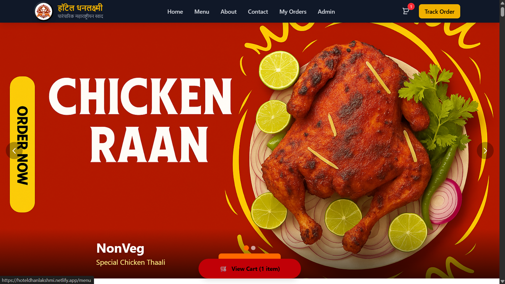

# हॉटेल धनलक्ष्मी
### Hotel Dhanlakshmi — Restaurant Management System

*"अन्नं हे पूर्ण ब्रह्म"*
*अन्न हीच खरी ऊर्जा आणि आपुलकीची भाषा आहे.*
**Food is divine — and the truest language of warmth.**

 

*[Live Site](https://hoteldhanlakshmi.netlify.app/)*

---

## अनुक्रमणिका · Table of Contents

- [About](#हॉटेलबद्दल--about-the-restaurant)
- [Features](#वैशिष्ट्ये--key-features)
- [Tech Stack](#तंत्रज्ञान--tech-stack)
- [User Flow](#वापर-प्रवाह--user-flow)
- [Security](#सुरक्षितता--security-highlights)
- [Business Capabilities](#व्यवसायिक-क्षमता--business-capabilities)
- [Deployment](#तैनाती--deployment)
- [Credit](#श्रेय--credit)

---

## हॉटेलबद्दल · About the Restaurant

*रहुरी फॅक्टरीतील मराठमोळ्या चवीचा वारसा — आता डिजिटल स्वरूपात.*
*The heritage of authentic Maharashtrian taste from Rahuri Factory — now digital.*

| | |
|---|---|
| **नाव · Name** | Hotel Dhanlakshmi |
| **पाककृती · Cuisine** | Authentic Maharashtrian — घरगुती, झणझणीत चव |
| **पत्ता · Address** | Nagar–Manmad Road, SH 10, Rahuri Factory, Maharashtra 413706 |
| **फोन · Phone** | [+91 72761 33639](tel:+917276133639) |
| **ईमेल · Email** | [hoteldhanlakshmi2025@gmail.com](mailto:hoteldhanlakshmi2025@gmail.com) |
| **नकाशा · Map** | [Google Maps वर पहा](https://www.google.com/maps/search/?api=1&query=19.4601289,74.5907646) |
| **JustDial** | [Dhanlaxmi Hotel, Rahuri Factory](https://www.justdial.com/Ahmednagar/Dhanlaxmi-Hotel-Rahuri-Factory/9999PX241-X241-161117181214-J8Y2_BZDET) |

---

## वैशिष्ट्ये · Key Features

### ग्राहकांसाठी · For the Customer

*"ग्राहक हाच आमचा खरा पाहुणा."* — *The customer is our true guest.*

- संपूर्ण मराठमोळा मेनू पहा — थाळी, भाकरी, मिसळ, झुणका आणि बरंच काही
  *Browse the complete Maharashtrian menu*
- नोंदणीशिवाय थेट ऑर्डर — *guest checkout, no forced login*
- कॅश ऑन डिलिव्हरी आणि Razorpay द्वारे ऑनलाइन पेमेंट
- ऑर्डरची लाईव्ह स्थिती — *real-time order tracking*
- दिवसभरातील सर्वाधिक विकले जाणारे पदार्थ — *best sellers of the day*
- सवलत कूपन प्रणाली — *discount coupons*
- मोबाईल, टॅबलेट, आणि डेस्कटॉपवर पूर्णपणे सुसंगत
- मराठी आणि इंग्रजी — दोन्ही भाषांमध्ये उपलब्ध

### प्रशासकांसाठी · For the Admin

*"व्यवस्थापन सोपं — नियंत्रण तुमच्या हातात."* — *Management made simple, control in your hands.*

- सुरक्षित प्रशासक लॉगिन — *secure admin login*
- ऑर्डर, पदार्थ आणि महसूल यांचे केंद्रीकृत डॅशबोर्ड
- रिअल-टाइम ऑर्डर व्यवस्थापन आणि स्थिती अद्ययावत
- कूपन तयार करणे आणि वापराचा मागोवा
- सर्वाधिक विक्री व महसूल विश्लेषण
- हॉटेलची माहिती, वेळा, आणि पेमेंट सेटिंग्ज व्यवस्थापन

---

## तंत्रज्ञान · Tech Stack

| स्तर · Layer | तंत्रज्ञान · Technology |
|---|---|
| Frontend | React, Vite, Tailwind CSS |
| Backend | Node.js, Express.js |
| Database | MongoDB |
| Payments | Razorpay |
| Notifications | WhatsApp Business API |
| Security | bcrypt, CORS, rate limiting |

---

## वापर प्रवाह · User Flow

**ग्राहक · Customer:**
मेनू → कार्ट → चेकआउट → पेमेंट → ऑर्डर ट्रॅकिंग
*Menu → Cart → Checkout → Payment → Track Order*

**प्रशासक · Admin:**
लॉगिन → डॅशबोर्ड → ऑर्डर व्यवस्थापन → मेनू अद्ययावत → कूपन → सेटिंग्ज
*Login → Dashboard → Manage Orders → Update Menu → Coupons → Settings*

---

## सुरक्षितता · Security Highlights

*"विश्वास हाच आमच्या सेवेचा पाया."* — *Trust is the foundation of our service.*

- bcrypt द्वारे पासवर्ड एन्क्रिप्शन
- API-संरक्षित प्रशासक मार्ग
- इनपुट पडताळणी आणि रेट लिमिटिंग
- पर्यावरण-आधारित कॉन्फिगरेशन — कोणतीही गुप्त माहिती कोडमध्ये नाही

---

## व्यवसायिक क्षमता · Business Capabilities

- दैनिक, साप्ताहिक व मासिक महसूल आकडेवारी
- सवलत कूपन वापराचे विश्लेषण
- सर्वाधिक विक्री होणाऱ्या पदार्थांचा स्वयंचलित मागोवा
- संपूर्ण ऑर्डर जीवनचक्र व्यवस्थापन — नोंद → पुष्टी → तयारी → वितरण

---

## तैनाती · Deployment

| घटक · Component | प्लॅटफॉर्म · Platform |
|---|---|
| Client | Netlify |
| Server | Render |
| Database | MongoDB Atlas |

---

## श्रेय · Credit

*हे संकेतस्थळ हॉटेल धनलक्ष्मीसाठी फ्रीलान्स प्रकल्प म्हणून विकसित केले आहे.*
*Designed and developed as a freelance engagement for Hotel Dhanlakshmi.*

**"अतिथी देवो भव"**
*The guest is akin to God.*

